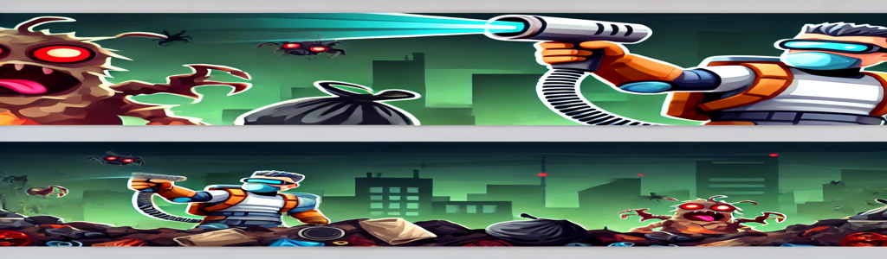

# Hack KU 2024 Project: Trash Troopers

 <!-- Replace with an actual image link if available -->

**Trash Troopers** is an immersive, fast-paced video game developed using the powerful `pygame` library in Python. In this game, players embark on an engaging mission to collect trash scattered across the screen while battling formidable trash monsters. Quick reflexes and strategic gameplay are your best allies as you tackle this challenge!

## 🌟 Gameplay Overview
- **Objective**: Collect all the trash that spawns on the screen to increase your score and boost your health.
- **Challenge**: Be on guard! Trash monsters will chase and try to deplete your health. Keep an eye on their movement and avoid direct contact as you race against time.

## 🎮 Controls
- **Movement**:
  - **WASD**: Move up, left, right, and down.
  - **Arrow Keys**: Alternate movement option.
- **Pause**:
  - **Esc**: Pause the game.
- **Attack**:
  - **Space Bar**: Hold to attack nearby trash monsters. But be careful – when they’re close enough to attack, they’re dangerously close to you!

## ⚙️ Game Mechanics
- **Health Bar**: Increases as you collect trash, but decreases rapidly if a monster makes contact.
- **Trash Spawning**: New trash items appear every 10 seconds. Stay on your toes and be quick to keep up with the pace!
- **Monster Behavior**:
  - Monsters patrol the area and will chase you when you enter their range.
  - Moving away from their proximity will de-aggravate them, but stay alert – attacking requires close range and precision.

## 📺 Demo and How to Play
Experience **Trash Troopers** in action with [this demo video](https://youtu.be/BwHD54nCl7g).

Want to play the game yourself? Download the latest version from the [v1.0 release](https://github.com/manees-singh/TrashTrooper/releases/tag/v1.0). Ensure that `trashtrooper.exe` and all necessary files are in the same directory.

## 💡 Tips for Success
- **Start Fast**: Move as soon as the game begins to avoid being caught off-guard by the monsters.
- **Plan Your Moves**: Keep track of trash positions and monsters to plan your collection strategy effectively.
- **Pause Wisely**: Use the `Esc` key to pause when needed, giving you time to reassess and strategize.

---

🎮 **Join the Cleanup Effort in Trash Troopers!**
Can you conquer the trash monsters, keep your health up, and clean the environment? Challenge yourself and show off your high score!

Good luck, and happy gaming!
